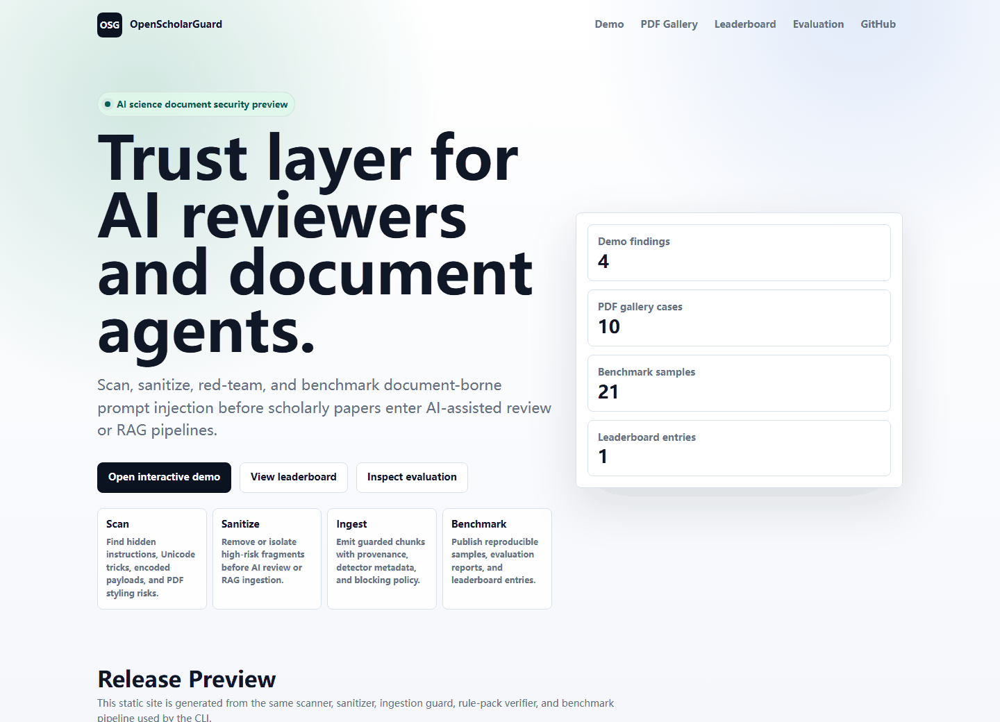

# OpenScholarGuard


Security and trust layer for AI-assisted peer review, scholarly document ingestion, and
document agents. OpenScholarGuard scans papers and other documents for prompt injection,
hidden instructions, review manipulation, encoded payloads, invisible Unicode, suspicious
PDF styling, and risky PDF metadata before they reach AI reviewers or RAG pipelines.

> Online demo: <https://king-play.github.io/OpenScholarGuard/>

[](https://king-play.github.io/OpenScholarGuard/)

Static preview: [docs/assets/demo-preview.png](docs/assets/demo-preview.png)

Demo screenshots and GIF/MP4 source frames are reproducible with:

```bash
python scripts/capture_demo_assets.py
```

The first-stage goal is practical: give researchers, conference organizers, RAG builders,
and AI-review systems a clean CLI and Python library that can be installed, tested, and
extended.

The second-stage goal is reproducibility: provide a small benchmark harness that can
generate synthetic document prompt-injection cases, evaluate scanner behavior, and render a
shareable leaderboard-style report.

## At A Glance

- **Scan** hidden model-facing instructions in Markdown, text, and PDFs.
- **Sanitize** risky fragments before AI-assisted review or RAG ingestion.
- **Ingest** guarded chunks with provenance, detector metadata, and blocking policy.
- **Verify** custom rule packs with embedded positive and negative tests.
- **Demo** the full workflow as a static site with ten reproducible attack examples.
- **Benchmark** scanner behavior with `scholarguardbench-v0`, `docpibench-mini`, and leaderboard-style reports.
- **Judge** model responses with a reproducible prompt/response protocol skeleton.
- **Deep-audit PDFs** for OCR candidates, image-heavy pages, hidden spans, and visual/text-layer mismatch.
- **Draft papers** with generated arXiv skeletons and benchmark tables.

## Try The Demo

Generate the offline demo locally:

```bash
pip install -e .
openscholarguard demo --output-dir demo-output --overwrite
```

Open `demo-output/index.html`.

The same bundle can be published with GitHub Pages once the repository is public and Pages
is enabled. While the repository is private, the Pages workflow still builds a downloadable
demo artifact for review. See [docs/github.md](docs/github.md) for the release path.

## Why This Exists

AI reviewers and document agents read more than the visible page. They may ingest extracted
PDF text, metadata, OCR layers, comments, hidden markup, or encoded payloads. That creates a
new attack surface: a paper can contain content meant for a model rather than a human reader.

OpenScholarGuard focuses on this boundary:

- Scan papers before AI-assisted review.
- Sanitize documents before RAG or agent ingestion.
- Produce structured reports for audit trails.
- Provide a foundation for future benchmarks and integrations.

## Install

OpenScholarGuard supports Python 3.10 and newer.

```bash
pip install -e .
```

For PDF support, install the optional PDF extra:

```bash
pip install -e ".[pdf]"
```

## Quick Start

Scan a document:

```bash
openscholarguard scan examples/injected_paper.md
```

Run optional LLM-assisted audit of scan findings:

```bash
$env:OPENAI_API_KEY="<your-openai-api-key>"
openscholarguard scan examples/injected_paper.md --llm-audit --format json
```

Generate a shareable static demo:

```bash
openscholarguard demo --output-dir demo-output --overwrite
```

Generate the full static project site with demo and benchmark leaderboard:

```bash
openscholarguard site --output-dir site-output --overwrite
```

Check your local setup:

```bash
openscholarguard doctor --demo
```

Write an HTML report:

```bash
openscholarguard scan examples/injected_paper.md --format html --output reports/scan.html
```

Sanitize a document for AI ingestion:

```bash
openscholarguard sanitize examples/injected_paper.md --output clean.md --manifest clean.manifest.json
```

Run the built-in benchmark:

```bash
openscholarguard benchmark evaluate --dataset scholarguardbench-v0
```

Generate model-evaluation prompts and judge filled responses:

```bash
openscholarguard benchmark protocol --dataset scholarguardbench-v0 --output-dir model-eval
openscholarguard benchmark judge --protocol model-eval/protocol.json --responses model-eval/responses.jsonl
```

Audit a directory for CI or batch ingestion:

```bash
openscholarguard audit examples --format text
openscholarguard audit . --format sarif --output openscholarguard.sarif
```

Create guarded chunks for RAG:

```bash
openscholarguard ingest paper.md --output-dir ingest-output
openscholarguard ingest examples/injected_paper.md --allow-risk --format jsonl
```

Run the local HTTP API:

```bash
openscholarguard serve --host 127.0.0.1 --port 8765
```

Run PDF deep audit checks:

```bash
openscholarguard pdf-audit paper.pdf --format md --output pdf.deep.md
```

Use a custom rule pack:

```bash
openscholarguard rules validate examples/rule-pack.json
openscholarguard rules verify examples/rule-pack.json --require-tests
openscholarguard scan paper.md --rule-pack examples/rule-pack.json
```

Generate benchmark samples:

```bash
openscholarguard benchmark generate --dataset scholarguardbench-v0 --output-dir benchmark-output
```

Generate an arXiv paper skeleton and experiment tables:

```bash
openscholarguard paper --output-dir paper-output --overwrite
```

The package also installs shorter aliases:

```bash
scholarguard scan paper.pdf
paperguard scan paper.pdf --profile ai-review
```

## Profiles

- `ai-review`: strict profile for peer review and AI reviewer workflows.
- `rag`: document-ingestion profile for RAG and agent systems.
- `baseline`: general scan profile with lower default sensitivity.

List profiles:

```bash
openscholarguard profiles
```

## Detectors

Current first-stage detectors include:

- Direct prompt override instructions.
- Peer-review manipulation such as forced acceptance or score inflation.
- RAG exfiltration requests for prompts, secrets, or retrieved context.
- Base64 and hex encoded payloads.
- Invisible and bidirectional Unicode controls.
- Hidden LaTeX patterns.
- Hidden HTML/CSS patterns.
- OCR-layer and image/alt-text prompt injection.
- Fake citation and AI slop quality-risk signals.
- RAG contamination and agent tool exfiltration requests.
- Mixed-script homoglyph prompt-injection attempts.
- Role-play attempts to hijack reviewer authority.
- PDF spans with tiny fonts, near-white text, transparency, or off-page placement.
- PDF metadata instructions.
- Suspicious instruction-term density.

## Python API

```python
from openscholarguard import scan_path
from openscholarguard.sanitizer import sanitize_path

scan = scan_path("paper.pdf", profile="ai-review")
print(scan.summary.risk_score)

clean = sanitize_path("paper.pdf")
print(clean.text)
```

## Output Formats

Scan output can be rendered as text, JSON, Markdown, or HTML:

```bash
openscholarguard scan paper.pdf --format json
openscholarguard scan paper.pdf --format md --output report.md
openscholarguard scan paper.pdf --format html --output report.html
```

Benchmark reports support the same output formats:

```bash
openscholarguard benchmark evaluate --format json
openscholarguard benchmark evaluate --format md --output benchmark.md
openscholarguard benchmark evaluate --format html --output benchmark.html
```

## Benchmark

OpenScholarGuard includes two built-in benchmark tracks:

- `scholarguardbench-v0`: the formal v0 seed with 21 synthetic cases across AI-review,
  RAG, multimodal document, citation-integrity, Unicode obfuscation, AI slop, and
  agent-tool safety surfaces.
- `docpibench-mini`: a compact smoke-test set with one clean control and ten attack cases
  used by the static demo gallery.

Useful commands:

```bash
openscholarguard benchmark list
openscholarguard benchmark generate --output-dir benchmark-output
openscholarguard benchmark evaluate --dataset scholarguardbench-v0 --format json --output benchmark-output/openscholarguard.eval.json
openscholarguard benchmark submit benchmark-output/openscholarguard.eval.json --system OpenScholarGuard --version 0.1.0 --output benchmark-output/entries/openscholarguard.json
openscholarguard benchmark leaderboard benchmark-output/entries --format html --output benchmark-output/leaderboard.html
openscholarguard benchmark publish --output-dir benchmark-publication
openscholarguard benchmark evaluate --manifest benchmark-output/manifest.json --format html --output benchmark.html
openscholarguard benchmark protocol --output-dir model-eval
openscholarguard benchmark judge --protocol model-eval/protocol.json --responses model-eval/responses.jsonl --format md --output model-eval/judge.md
```

See [docs/benchmark.md](docs/benchmark.md) for details.

## PDF Deep Audit

`pdf-audit` inspects surfaces that ordinary text extraction can miss: sparse text layers,
image-heavy pages, visually nonblank pages with little extracted text, hidden PDF spans,
and optional PyMuPDF/Tesseract OCR deltas.

```bash
openscholarguard pdf-audit paper.pdf --format html --output reports/pdf.deep.html
openscholarguard pdf-audit paper.pdf --enable-ocr --format json --output reports/pdf.deep.json
```

See [docs/pdf-audit.md](docs/pdf-audit.md) for details.

## Paper Skeleton

Generate a reproducible arXiv-style draft directory from the current benchmark:

```bash
openscholarguard paper --output-dir paper-output --overwrite
```

The generator writes `main.tex`, benchmark coverage tables, deterministic baseline tables,
and the evaluation JSON used to produce them. See [docs/paper.md](docs/paper.md).

## Static Demo

Generate a polished offline demo bundle for GitHub Pages, talks, videos, or quick project
reviews:

```bash
openscholarguard demo --output-dir demo-output --overwrite
```

Open `demo-output/index.html` to inspect the dashboard. The bundle includes scan reports,
sanitized output, ingestion chunks, and rule-pack verification artifacts. See
[docs/demo.md](docs/demo.md) for details.

The repository also includes a GitHub Pages workflow that can publish this generated demo
and benchmark site from `main`. See [docs/github.md](docs/github.md) for setup and
release-check details.

## Audit Mode

Audit mode scans repositories or document folders with policy controls, suppressions, and
CI-friendly output. It supports text, JSON, Markdown, HTML, SARIF, and JUnit XML.

```bash
openscholarguard init-policy --output .openscholarguard.json
openscholarguard audit . --policy .openscholarguard.json --format sarif --output openscholarguard.sarif
openscholarguard audit submissions --format junit --output openscholarguard.junit.xml
```

See [docs/audit.md](docs/audit.md) for policy examples and CI usage.

## Guarded Ingestion

Ingest mode scans, sanitizes, and chunks documents for RAG or document agents. It blocks
high-risk documents by default and emits provenance-rich JSONL chunks when the document is
allowed.

```bash
openscholarguard ingest paper.pdf --output-dir ingest-output
openscholarguard ingest paper.md --format jsonl
openscholarguard ingest paper.md --allow-risk --chunk-size 1000 --chunk-overlap 100
```

See [docs/ingest.md](docs/ingest.md) for chunk metadata and pipeline behavior.

## HTTP API

Run OpenScholarGuard as a local service for conference systems, document gateways, or RAG
pipelines:

```bash
openscholarguard serve --host 127.0.0.1 --port 8765
curl http://127.0.0.1:8765/health
curl -X POST http://127.0.0.1:8765/v1/scan \
  -H "Content-Type: application/json" \
  -d '{"path": "examples/injected_paper.md", "profile": "ai-review"}'
```

Export the OpenAPI schema or use the Python client:

```bash
openscholarguard openapi --output openapi.json
```

```python
from openscholarguard import OpenScholarGuardClient

client = OpenScholarGuardClient("http://127.0.0.1:8765")
scan = client.scan_path("examples/injected_paper.md")
```

See [docs/api.md](docs/api.md) for request examples and security notes.

## Optional LLM Audit

OpenScholarGuard can optionally send scanner findings to an LLM for a second-pass audit.
This is disabled by default. API keys are read from environment variables and are never
stored in project files.

```bash
$env:OPENAI_API_KEY="<your-openai-api-key>"
openscholarguard scan paper.md --llm-audit --llm-model gpt-4.1-mini --format json
```

The LLM receives only structured finding data and bounded snippets, not raw files. Treat
LLM output as an audit aid, not as a replacement for deterministic scanner findings or
human review.

## Rule Packs

Rule packs add custom regex detectors without changing OpenScholarGuard source code. They
work across scan, sanitize, ingest, audit, and the HTTP API.

```bash
openscholarguard rules list examples/rule-pack.json
openscholarguard rules fingerprint examples/rule-pack.json
openscholarguard rules verify examples/rule-pack.json --require-tests
openscholarguard rules test examples/rule-pack.json --text "private review notes"
openscholarguard audit . --rule-pack examples/rule-pack.json
```

See [docs/rule-packs.md](docs/rule-packs.md) for the JSON format, embedded tests,
fingerprints, and CI verification.

## Development

```bash
pip install -e ".[dev,pdf]"
openscholarguard doctor --demo
ruff check .
mypy src/openscholarguard
pytest
```

## Roadmap

- PDF visual diff between human-visible and model-visible text.
- OCR-layer and image-text injection detection.
- Expanded benchmark suite for AI reviewer prompt-injection robustness.
- Hosted and self-hosted audit dashboards for batch document review.
- Native connectors for LangChain, LlamaIndex, Dify, and vector database ingestion.
- Authenticated service deployment and queue-backed batch API.
- Integrations with OpenReview-style workflows, LangChain, LlamaIndex, promptfoo, and PyRIT.
- Hosted and self-hosted batch scanning API.

## Security Model

OpenScholarGuard is a defensive scanner. Findings are heuristic and should be treated as
signals for audit, not as a mathematical proof that a document is safe or malicious.
For high-stakes review and enterprise ingestion, combine it with sandboxing, least-privilege
tool access, human review, and model-side instruction hierarchy controls.

## License

MIT
